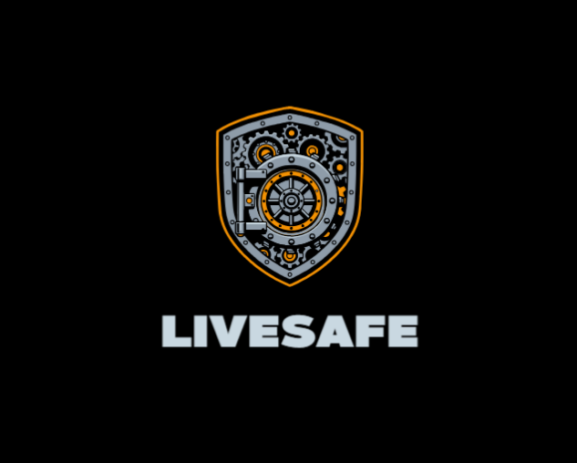

<div align="center">



<h1 align="center">LiveSafe AI</h1>

<p align="center">
  <strong>Predictive Public Safety Platform for Indian Cities</strong>
</p>

<p align="center">
  
  
  
  
</p>

<p align="center">
  <a href="#overview">Overview</a> •
  <a href="#features">Features</a> •
  <a href="#tech-stack">Tech Stack</a> •
  <a href="#architecture">Architecture</a> •
  <a href="#quick-start">Quick Start</a> •
  <a href="#api-routes">API</a>
</p>

</div>

---

## Overview

**LiveSafe AI** is a PNPM monorepo for a predictive public safety platform built around Indian crime-risk analysis, SOS workflows, and role-based operational dashboards.

The project currently includes:

- a React + Vite frontend in `artifacts/livesafe`
- an Express API server in `artifacts/api-server`
- shared libraries in `lib/*`
- an NCRB-based hotspot dataset and v5 prediction flow

The current app is also resilient in demo mode:

- hotspot data can load from Supabase or local generated JSON
- reports, prediction, ML metrics, and SOS flows can fall back cleanly when `/api` is unavailable
- the citizen map now includes a real route-planning flow, safety modes, and a dedicated safety-contacts screen

### Current project state

| Metric | Value |
|--------|-------|
| Hotspot dataset | NCRB-based v5 output |
| Published training window in app | 2020-2023 |
| Current local hotspot file | `artifacts/livesafe/public/india_hotspots_v5.json` |
| Local fallback coverage | 116 cities |
| Verified build status | Frontend build passes |

---

## Features

### Citizen Safety Experience

- Interactive hotspot map with risk visualization
- Safe Route Navigator with:
  - current location support
  - destination selection
  - safer route recommendations
  - safe hubs and fallback guidance
- Scenario-aware travel modes:
  - Everyday
  - Night
  - Women
  - Student
- Dedicated `Safety Contacts` page for trusted emergency phone numbers
- Incident reporting flow

### SOS Safety Network

- Emergency SOS trigger flow
- Live location sharing and movement trail
- Dead-man switch auto-escalation
- Audio/video evidence capture
- Unified responder flow for:
  - police dispatch
  - family contacts
  - volunteers
  - hospital standby

### Police and Admin Operations

- SOS operations workflow with responder coordination
- Analytics and incident trend views
- Decision-support dashboard with:
  - zone prioritization
  - patrol allocation guidance
  - response simulation
  - cluster and repeat-location insights
- ML dashboard and user management

### Offline / Fallback Behavior

If `/api` is unavailable, the frontend still degrades gracefully for:

- hotspot map
- reports and analytics summaries
- ML dashboard metrics
- prediction models
- SOS pages

That keeps the app usable for demos and local review even without the backend running.

---

## Tech Stack

### Frontend

- React
- Vite
- TypeScript
- Tailwind CSS
- Lucide icons
- Leaflet
- Recharts

### Backend

- Node.js
- Express
- Drizzle ORM
- PostgreSQL

### Data / ML

- Python-based training pipeline
- NCRB-derived hotspot output
- v5 risk scoring and explainability flow

### Tooling

- PNPM monorepo
- Supabase

---

## Architecture

```text
LiveSafe (PNPM Monorepo)
│
├── artifacts/
│   ├── livesafe/             # React + Vite frontend
│   │   ├── src/
│   │   │   ├── components/
│   │   │   │   ├── new-ui/   # Main app shell and role-based screens
│   │   │   │   ├── layout/
│   │   │   │   ├── ui/
│   │   │   │   └── HotspotMapNew.tsx
│   │   │   ├── pages/        # Route pages
│   │   │   ├── app/
│   │   │   │   ├── hooks/
│   │   │   │   └── services/
│   │   │   ├── data/
│   │   │   └── lib/
│   │   └── public/
│   │       ├── livesafe-logo.png
│   │       └── india_hotspots_v5.json
│   │
│   └── api-server/           # Express API server
│       ├── src/
│       │   ├── routes/
│       │   ├── lib/
│       │   └── middlewares/
│       └── build.mjs
│
├── lib/
│   ├── db/                   # Drizzle schema
│   ├── api-spec/
│   ├── api-zod/
│   └── api-client-react/
│
└── scripts/
```

---

## Quick Start

### Prerequisites

- Node.js `>= 22`
- PNPM `>= 10`

### Install

```bash
pnpm install
```

### Frontend environment

The Vite config requires:

- `PORT`
- `BASE_PATH`

Optional frontend env vars:

- `VITE_SUPABASE_URL`
- `VITE_SUPABASE_ANON_KEY`
- `VITE_USE_MOCK`
- `VITE_API_PROXY_TARGET`

`VITE_USE_MOCK` behavior:

- `true` -> always use local/demo behavior
- `false` -> prefer real services but still fall back locally when responses are bad or unavailable
- unset -> auto mode based on available config

### Run the frontend

#### Windows PowerShell

```powershell
$env:PORT='5173'
$env:BASE_PATH='/'
pnpm --filter @workspace/livesafe dev
```

Then open:

- `http://localhost:5173/`
- `http://localhost:5173/map`
- `http://localhost:5173/map?screen=hotspot`

### Run the API server

```bash
pnpm --filter @workspace/api-server build
pnpm --filter @workspace/api-server start
```

Note: the current backend `dev` script is Unix-oriented, so on Windows the safer path is still `build` + `start` unless that script is adjusted.

### Build

#### Frontend

```powershell
$env:PORT='5173'
$env:BASE_PATH='/'
pnpm --filter @workspace/livesafe build
```

#### Full workspace

```bash
pnpm run build
```

### Typecheck

```bash
pnpm run typecheck
```

---

## API Routes

These are the main route families in the current project:

| Method | Endpoint | Description |
|--------|----------|-------------|
| `GET` | `/health` | API health check |
| `POST` | `/auth/register` | User registration |
| `POST` | `/auth/login` | User login |
| `POST` | `/auth/logout` | Logout |
| `GET` | `/auth/me` | Current user |
| `GET` | `/hotspots` | Crime hotspot data |
| `POST` | `/sos` | Trigger SOS |
| `GET` | `/sos` | List SOS alerts |
| `POST` | `/sos/:id/acknowledge` | Acknowledge SOS |
| `POST` | `/sos/:id/resolve` | Resolve SOS |
| `PATCH` | `/sos/:id` | Update SOS state |
| `PATCH` | `/sos/:id/responders/:responderId` | Update responder state |
| `PATCH` | `/sos/:id/evidence/:evidenceId` | Update evidence review state |
| `POST` | `/incidents` | Report incident |
| `GET` | `/incidents` | List incidents |
| `GET` | `/analytics/dashboard` | Dashboard statistics |
| `GET` | `/ml/stats` | ML performance / metrics |
| `GET` | `/admin/users` | User management |

---

## Notes for Supabase

- Supabase is still used directly by the frontend for some reads.
- If the remote `hotspots` table is incomplete, the frontend falls back to the local generated hotspot dataset.
- Anonymous-key writes may be blocked by RLS, so fully syncing retrained hotspot rows usually requires a proper backend/admin path.

---

## Useful Commands

```bash
# frontend dev
pnpm --filter @workspace/livesafe dev

# frontend build
pnpm --filter @workspace/livesafe build

# backend build
pnpm --filter @workspace/api-server build

# backend start
pnpm --filter @workspace/api-server start

# workspace typecheck
pnpm run typecheck

# workspace build
pnpm run build
```

---

## Acknowledgements

- NCRB crime datasets and derived analysis inputs
- OpenStreetMap for map tiles and geographic context
- React, Vite, Leaflet, Recharts, and the supporting open-source ecosystem

---

<div align="center">

<p><strong>Built for safer communities with predictive intelligence and faster response workflows.</strong></p>

<p><sub>LiveSafe AI • CodeNakshatra</sub></p>

</div>
